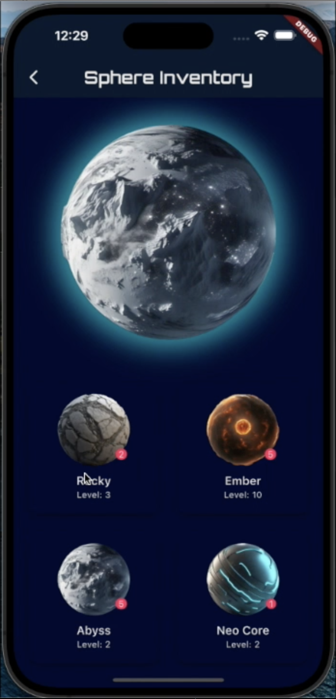
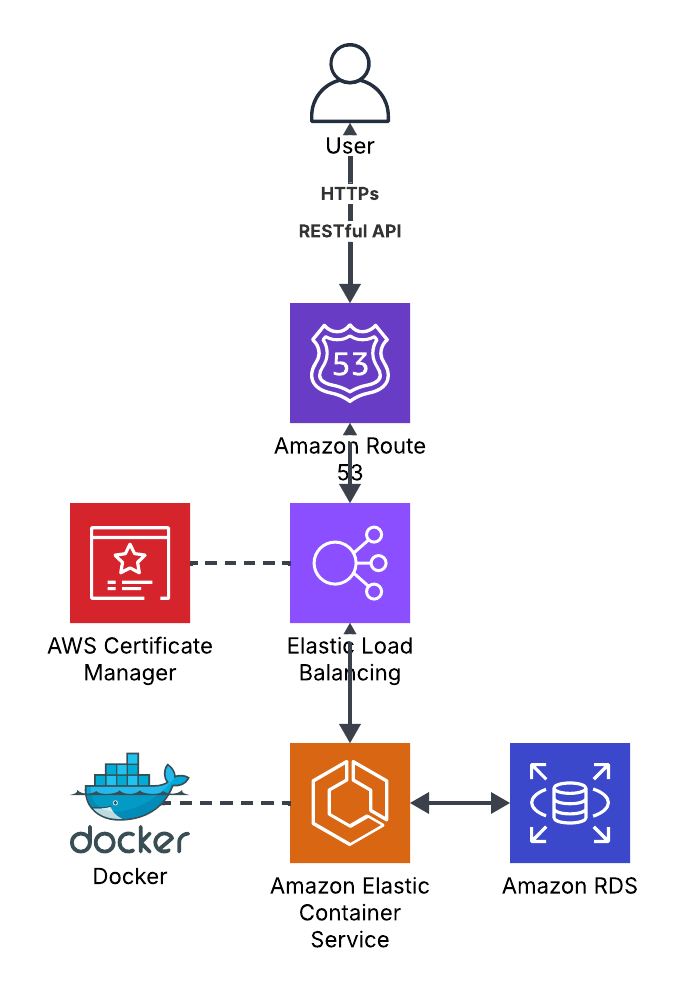

# Weight-Training-Assistant-Mobile-App
The mobile application which helps users to plan trainings by suggesting recommendable training programs based on the users' demographic and the purpose of the workout.

## Table of Contents
- [Features](#features)
- [Screenshots](#screenshots)
- [Technologies](#technologies)
- [Installation](#installation)
- [License](#license)
- [TODO](#todo)

## Features
- User Authentication JWT

- Secure connection through HTTPs with Amazon Certification Manager (ACM)
  
- Workout plan recommendation
  
- Chronometric postpone workout plans
  
- Random reward collection

## Screenshots

## Technologies
- Platform: cross-platform

- Programming Languages: Dart, Java

- Frameworks: Flutter, Springs boot

- Backend Services: AWS

- Other Tools: Version control (Git), CI/CD pipelines (GitHub Action), Docker

### Architecture Diagram

## Installation
Follow these steps to get the project up and running from the `local` branch:

### Backend Deploy

#### 1. Prerequisites
- Java 21 JDK:
  
  Ensure Java 21 is installed and JAVA_HOME is set.

- Git:
  
  To clone the repo.

#### 2. Clone Repository
    git clone --branch local https://github.com/your-username/your-repo.git

Go to the branch named 'local':

    git checkout local

#### 3. Go to backend Folder Directory
    cd backend

#### 4. Build the Project
    ./gradlew clean build

#### 5. Run Java Spring Boot Backend 
    ./gradlew bootRun

### Frontend Deploy
#### 1. Prerequisites
- Flutter:
  
  https://docs.flutter.dev/get-started/install

- Emulator / Simulator:

  - Android Emulator, Android Studio, Android SDK, Virtual Device(AVD) or

  - IOS Simulator (macOS only), Xcode command-line tools

#### 2. Go to frontend Folder Directory
  From the proejct root
      
    cd frontend
#### 2. Fetch Packages
    flutter pub get

#### 3. Configure Platforms
- Android:

    Open android/ in Android Studio and let it sync Gradle.
    
    Ensure an Android SDK (API level ≥ 21) and a virtual device (AVD) are installed.

- iOS (macOS only):

      cd ios
      pod install
      cd ..
    Make sure you have CocoaPods (gem install cocoapods) and Xcode command-line tools installed.

#### 4. Run Emulator/Simulator or Device
- Android:
  
      flutter emulators --launch <emulator_id>

- IOS:
  
      open -a Simulator

#### 5. Run the App
    flutter run

## License

This project is licensed under the MIT License - see the [LICENSE](LICENSE) file for details.

## TODO
- [ ] Add user location code to dynamically apply chronometric function
      
- [ ] Add exercise gifs
  
- [ ] Add marking calendar for completed workout plans
  
- [ ] Add Spheres weekly
  
- [ ] Update search exercise widget with api pagination
  
- [ ] Update search exercise widget exercise category and muscle group
  
- [ ] Add 0Auth register with Apple, Google
  
- [ ] Add find password function
  
- [ ] Add community to share spheres
  
- [ ] Add sphere decoration function
  
- [ ] Add advertisement banner
  
- [ ] Deploy app through Apple app store
  
- [ ] Test with Android
  
- [ ] Deploy app through Google store
  
